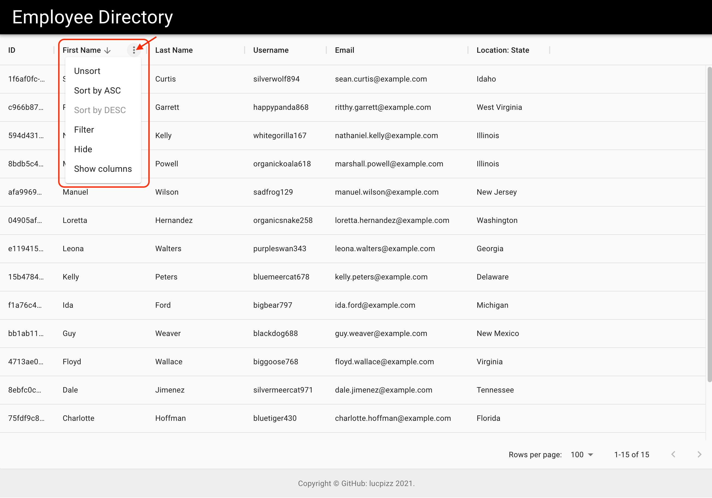

    

# Employee-Org-Chart

## Table of Contents

- [Description](#description)
- [Screenshot](#screenshot)
- [Installation](#installation)
- [Usage](#usage)
- [Contributing](#contributing)
- [Questions](#question)
- [License](#license)

---

## Description

This program is a simple and intuitive employee listing site to view thier data.

## Screenshot

You can use the title bar columns to sort and find employees.

## Installation

1. Create this repostiory by using the GitHub forking process onto your computer
2. Install NPM the Node Project Manager to your program directory
3. Install dependecies to your program directory (npm install)
4. Build the App (npm run start)
5. Run the App (npm start)

---

## Usage

This program is designed to view and quickly access employee information.

---

## Contributing

GitHub Username - lucpizz

Please list your name here if you are contributing to this project.

---

## Questions

Please contact me at lucpizz@gmail.com for any questions regarding this program.

---

## License

MIT License

Copyright (c) 2021 Luca Pizzoferrato

Permission is hereby granted, free of charge, to any person obtaining a copy of this software and associated documentation files (the "Software"), to deal in the Software without restriction, including without limitation the rights to use, copy, modify, merge, publish, distribute, sublicense, and/or sell copies of the Software, and to permit persons to whom the Software is furnished to do so, subject to the following conditions:

The above copyright notice and this permission notice shall be included in all copies or substantial portions of the Software.

THE SOFTWARE IS PROVIDED "AS IS", WITHOUT WARRANTY OF ANY KIND, EXPRESS OR IMPLIED, INCLUDING BUT NOT LIMITED TO THE WARRANTIES OF MERCHANTABILITY, FITNESS FOR A PARTICULAR PURPOSE AND NONINFRINGEMENT. IN NO EVENT SHALL THE AUTHORS OR COPYRIGHT HOLDERS BE LIABLE FOR ANY CLAIM, DAMAGES OR OTHER LIABILITY, WHETHER IN AN ACTION OF CONTRACT, TORT OR OTHERWISE, ARISING FROM, OUT OF OR IN CONNECTION WITH THE SOFTWARE OR THE USE OR OTHER DEALINGS IN THE SOFTWARE.